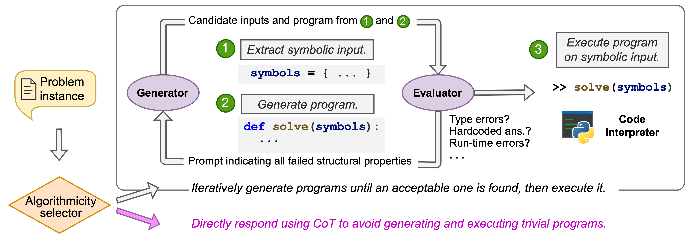

<h1 align="center">PIPS: Per-Instance Program Synthesis</h1>

<p align="center">
  
</p>

<div align="center">
<a href="https://huggingface.co/spaces/steinad/PIPS-demo">

</a>

</div>


Per-Instance Program Synthesis (PIPS) is an adaptive reasoning baseline that decides, for every problem instance, whether to run deliberate chain-of-thought reasoning or synthesize executable Python code.

## News

- **[10/26/2025]** Code for PIPS as well as web interface and gradio app are released.
- **[09/18/2025]** PIPS accepted to NeurIPS 2025!

## Why try PIPS?
- Adaptive per-instance strategy selection that balances executable program synthesis with fast chain-of-thought reasoning.
- Iterative code refinement with automatic execution, error recovery, and optional interactive checkpoints.
- Real-time observability via structured logs, token streaming, and persisted sessions that make debugging or research comparisons easy.
- Drop-in baseline: run the web app with one command or import a single class to embed Per-Instance Program Synthesis inside your stack.

## Install
```bash
git clone <repository-url>
cd PIPS
pip install -e .

# Optional extras
pip install -e .[web]   # UI dependencies
pip install -e .[dev]   # linting & tests
```

## Configure providers
Export whichever API keys you plan to use:
```bash
export OPENAI_API_KEY="..."
export ANTHROPIC_API_KEY="..."
export GOOGLE_API_KEY="..."
```
Only one key is required to get started.

## Use PIPS from Python
```python
from pips import PIPSSolver, get_model
from pips.utils import RawInput

model = get_model("gpt-4o", api_key="your-openai-api-key")
solver = PIPSSolver(model=model, max_iterations=8, temperature=0.0)

problem = RawInput(text_input="What is the sum of the first 10 prime numbers?")
answer, telemetry, mode_decision = solver.solve(problem, stream=False)
print("Answer:", answer)
```
Set `stream=True` and pass callbacks such as `on_llm_streaming_token` or
`on_step_update` to receive incremental updates. For complete control you can
call `solve_with_code` or `solve_chain_of_thought` directly, and the same
callbacks work for both.

## Run the Gradio App
We also provide a Gradio web app which can be used to interactively experiment
with PIPS from the browser. To run the app, run the following:
```bash
python src/pips/gradio_app.py
```

The web app provides an interface for entering API keys through the browser, so
they do not need to be configured beforehand.

## Supported providers
PIPS supports any OpenAI, Anthropic, or Google model through their API
endpoints. Models hosted with VLLM are also supported.

## Sessions and exports
Per-Instance Program Synthesis stores runs in browser local storage, shipping
with curated examples on first launch. You can export or import sessions as
JSON files—handy for sharing baselines or reproducing papers.

## License
MIT
